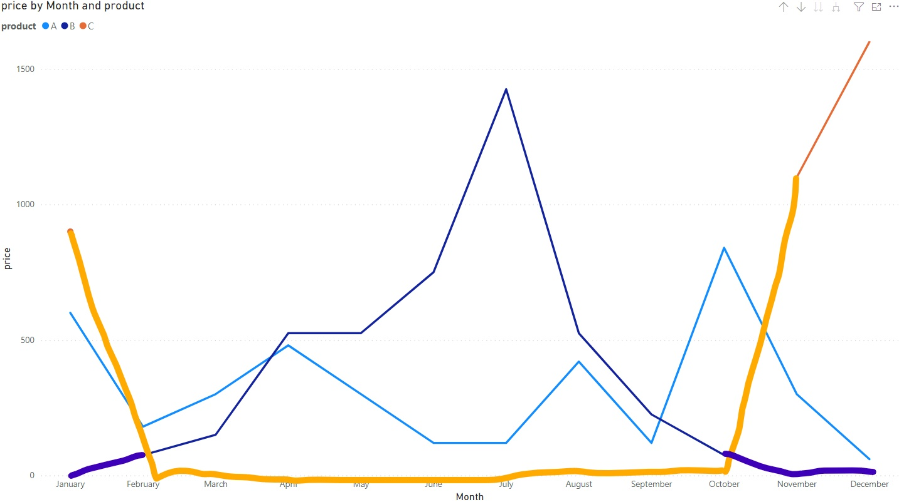

```{r setup, include=FALSE}
knitr::opts_chunk$set(echo = FALSE)
```

# Power BI and Missing Values {.title_slide .center}

Tyler Bradley

# Background Example {.normal_slide}

- Start out with base data to graph


# Background Example {.normal_slide}
<div style="margin-top: 7%; margin-bottom: 15%;">
```{}
month_date = STARTOFMONTH(orders_small[date])
```
</div>


# Background Example {.normal_slide}


# Background Example {.normal_slide}


  
# Background Example {.normal_slide}


# Background Example {.normal_slide}



# Background Example {.normal_slide}

```{}
sum_price = SUM(orders_small[price])
```
```{}
distinct_months = DISTINCTCOUNT(orders_small[month_date])
```
```{}
monthly_average = DIVIDE([sum_price], [distinct_months])
```


# End Product {.normal_slide}

- Line graphs by product over time
- Price
- Number of orders
- Number of distinct customers
- Filter by product and month
- Fill in zeros for sales when product is available

# Basic Strategies {.section_slide .center}

# Basic Strategies {.normal_slide}

- Show missing items


- Doesn't work in this example

# Basic Strategies {.normal_slide}

```{}
sum_price_zero = SUM(orders_small[price]) + 0
```


- Doesn't fix table

# Basic Strategies {.normal_slide}

- Fix the math

```{}
monthly_average = DIVIDE([sum_price], 12)
```


- Doesn't fix graph

# Basic Strategies {.normal_slide}

- Clean the data
- Import monthly data
- Import zero

# Basic Strategies {.normal_slide}

- Tend to work easily
- But tend to not be extendable

# Better Strategies {.section_slide .center}

# Better Strategies {.normal_slide}

- Calendar Table Setup

# Calendar Table (Specific Dates) {.normal_slide}
<div class="fragment" style="margin-top: 7%; margin-bottom: 15%;">
- What is this
</div>
<div class="fragment" style="margin-bottom: 15%;">
- Same concept but not for dates
</div>
<div class="fragment">
- Three examples
</div>

# Calendar Table {.normal_slide}
```{}
cal_table = CALENDAR(
  DATE(2020, 01, 01),
  DATE(2020, 12, 31))
```
```{}
cal_table = CALENDAR(
  DATE(YEAR(TODAY()) - 1, 01, 01),
  DATE(YEAR(TODAY()) - 1, 12, 31))
```
```{}
cal_table = CALENDAR(
  MIN(orders_small[date]),
  MAX(orders_small[date]))
```

# Calendar Table {.normal_slide}

- Need image of cal table here

# Calendar Table {.normal_slide}


  
# Better Strategies {.normal_slide}

- Calendar Table Setup

- Star Schema

# Star Schema {.normal_slide}

- Need image of cal table here

# Better Strategies {.normal_slide}

- Calendar Table Setup

- Star Schema

- ADDMISSINGITEMS()