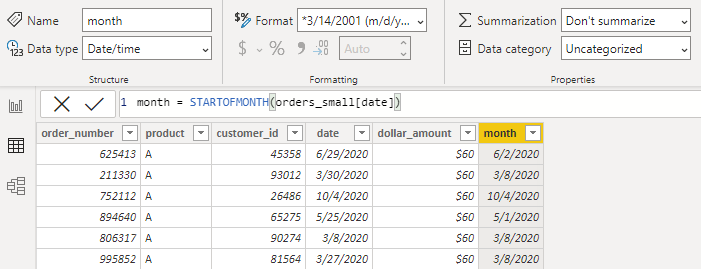

```{r setup, include=FALSE}
knitr::opts_chunk$set(echo = FALSE)
```

# Power BI and Missing Values {.title_slide .center}

Tyler Bradley

<aside class="notes">
This presentation comes from a project I worked on involving these issues with missing values in Power BI. For this presentation, I'm assuming you have some familiarity with Power BI. So, I won't walk through all the basics like pulling in data but start after the beginning steps.
</aside>


# Setup {.normal_slide}
<div style="margin-top: 7%; margin-bottom: 10%;">
- Background Example
</div>
<div style="margin-bottom: 10%;">
- Basic Strategies
</div>
<div style="margin-bottom: 10%;">
- Better Strategy
</div>
<div>
- Polishing
</div>

<aside class="notes">
For today's setup, we'll cover a background example that explains the issues, go through some basic strategies that might solve your problem, a better strategy that's more work but a lot more robust, and then some additional options for polishing the dashboard.
</aside>


# Background Example {.normal_slide}
<div style="margin-top: 7%;">
- Start out with some data to graph
</div>


<aside class="notes">
We'll start with an orders table called orders_small. Each row is an order that contains the order number, the product that was sold, a customer id, the date, and the dollar amount. The goal here is to get information on sales over time for each product. So we basically need to sum the dollar amount by date.
</aside>


# Background Example {.normal_slide}
<div style="margin-top: 7%;">
```{}
month = STARTOFMONTH(orders_small[date])
```
</div>


<aside class="notes">
Showing the data by day will be too granular, so we want to get it into months. We can add in some DAX code to create a new column for the month of each order. We'll also just use the date as a date hierarchy and compare the methods.
</aside>


# Background Example {.normal_slide}
<div style="margin-top: 7%;">

</div>

<aside class="notes">
This graph uses the month column we just created. You can see there are some missing values at the start and end of the dark blue line. However, the orange line is suspiciously straight.
</aside>


# Background Example {.normal_slide}
<div style="margin-top: 7%;">

</div>

<aside class="notes">
This graph uses the date column from the data at the month level. You still see the missing values for the dark blue line, but now the orange line has missing values. This is because the other graph was just connecting the segments across January to November.
</aside>


# Background Example {.normal_slide}
<div style="margin-top: 7%;">

</div>  

<aside class="notes">
Looking closely at the graph, we see that these three products sell at different times of the year. Product A sells year-round. Product B is only in the summer, while product C is only in the winter. 
</aside>


# Background Example {.normal_slide}
<div style="margin-top: 7%;">

</div>

<aside class="notes">
What we really want to see are all the lines filled in down to zero. The poorly drawn lines display what we want to get at the end.
</aside>


# Background Example {.normal_slide}
<div style="margin-top: 7%;">
```{}
sum_amount = SUM(orders_small[dollar_amount])
```
```{}
distinct_months = DISTINCTCOUNT(orders_small[month])
```
```{}
monthly_average = DIVIDE([sum_amount], [distinct_months])
```
</div>


<aside class="notes">
We can also see that this can mess up any calculations. In this example, the monthly_average is wrong because distinct_months is incorrect for selling over an entire year.
</aside>


# End Product {.normal_slide}
<div class="fragment" style="margin-top: 7%; margin-bottom: 7%;">
- Line graphs and tables by product over time
</div>
<div class="fragment" style="margin-bottom: 7%;">
- Dollar amount
- Number of distinct customers
- Number of orders
</div>
<div class="fragment" style="margin-bottom: 7%;">
- Filter by product and month
</div>
<div class="fragment">
- Fill in zeros when product was available
</div>

<aside class="notes">
For this presentation, we'll focus on creating an end product that has the following features. Line graphs and tables by product over time. Graphs and tables for dollar amounts, number of distinct customers, and number of orders. The ability to filter by product and month. And finally, fill in zeros when the product was available.
</aside>


# Basic Strategies {.section_slide .center}

<aside class="notes">
The following section will cover some basic strategies to fill in zeros for missing values. These techniques will handle a lot of problems and are pretty easy to implement.
</aside>


# Basic Strategies {.normal_slide}
<div class="fragment" style="margin-top: 7%; margin-bottom: 3%;">
- Show missing items


</div>
<div class="fragment">
- Doesn't work in this example
</div>

<aside class="notes">
If you click on the down arrow on your axis, there will be an option for 'Show items with no data'. This is always the first option I try. Unfortunately, it only works in some situations and doesn't work in this example.
</aside>


# Basic Strategies {.normal_slide}
<div class="fragment" style="margin-top: 7%; margin-bottom: 5%;">
```{}
sum_amount_zero = SUM(orders_small[dollar_amount]) + 0
```
<div>
<div class="fragment" style="margin-bottom: 5%;">

<div>
<div class="fragment">
- Doesn't fix table
</div>

<aside class="notes">
We can just fix the math if you know it's a constant. All we need to do is add 0 to the end of our measure, and it will fill in for us. But, unfortunately, this only fixes the graph and not the table.
</aside>


# Basic Strategies {.normal_slide}
<div class="fragment" style="margin-top: 7%;">
```{}
monthly_average = DIVIDE([sum_amount], 12)
```
<div>
<div style="margin-bottom: 5%;">
::: {.container}
:::: {.col}

::::
:::: {.col}

::::
:::
</div>
<div class="fragment">
- Doesn't fix graph
</div>

<aside class="notes">
We can fix the table by skipping the DISTINCTCOUNT on months and replace it all with 12. This will get the correct monthly_average. However, this only works when we know it's always 12. Also, it doesn't fix the graph.
</aside>


# Basic Strategies {.normal_slide}
<div class="fragment" style="margin-top: 7%; margin-bottom: 15%;">
- Clean up the data by:
</div>
<div class="fragment" style="margin-bottom: 15%;">
- Importing monthly data
</div>
<div class="fragment" >
- Importing zero
</div>

<aside class="notes">
Finally, we can always just fix the issues in the data. For example, we can clean up data by importing monthly data from the start and importing rows with zeros. There are ways to do that in SQL and Power Query. We won't go into them in this presentation, but it's a great option if you know you'll never need more granular data.
</aside>


# Basic Strategies {.normal_slide}
<div class="fragment" style="margin-top: 10%; margin-bottom: 20%;">
- Tend to work easily
</div>
<div class="fragment" >
- But tend to not be extendable
</div>

<aside class="notes">
These strategies tend to work very easily. None of them took a lot of effort to implement from where we started. However, they tend to not be extendable. We have to mix and match these strategies to get everything, and that's annoying. They can fall apart for more advanced calculations and become messy when trying to keep it all together. In my experience, if you just need basic graphs and tables, these are great. However, a more thorough setup can be better if you know you'll need more advanced calculations and interactivity.
</aside>


# Better Strategy {.section_slide .center}
<aside class="notes">
This next section goes through that more thorough setup. We'll reset everything and build a stronger start that enables us to get any calculations we need.
</aside>


# Setup with Bigger Dataset {.normal_slide}
<div style="margin-top: 7%;">

</div>  

<aside class="notes">
There's still a year of data but a lot more products. There are other trends, including decreasing or increasing over time, and even products that only sold for one month (those are the points). We'll call this orders_big.
</aside>


# End Product {.normal_slide}
<div style="margin-top: 7%; margin-bottom: 7%;">
- Line graphs and tables by product over time
</div>
<div style="margin-bottom: 7%;">
- Dollar amount
- Number of distinct customers
- Number of orders
</div>
<div style="margin-bottom: 7%;">
- Filter by product and month
</div>
<div>
- Fill in zeros when product was available
</div>

<aside class="notes">
This is just a reminder of what we're looking to create by the end. Line graphs and tables by product over time. Graphs and tables for dollar amounts, number of distinct customers, and number of orders. The ability to filter by product and month. And finally, fill in zeros when the product was available.
</aside>


# Better Strategy {.normal_slide}
<div class="fragment" style="margin-top: 7%;">
- Calendar Table Setup
</div>

<aside class="notes">
There are three parts to this section. The first part is setting up a calendar table to use as a date dimension.
</aside>


# Calendar Table {.normal_slide}
<div class="fragment" style="margin-top: 7%; margin-bottom: 7%;">
- Table created in Power BI that contains all the dates you need and associated information, using the CALENDAR function.
</div>
<div class="fragment" style="margin-bottom: 7%;">
- The CALENDAR function needs a start date and end date.
</div>
<div class="fragment" style="margin-bottom: 7%;">
- Fills in the day in between (including start and end dates).
</div>
<div class="fragment">
- Three examples
</div>

<aside class="notes">
A calendar table is a table created in Power BI that contains all the dates you need and associated information. We'll use the Calendar Dax function. This function requires a start and end date. It'll then fill out all the dates in between (including the start and end dates). We'll go through three examples.
</aside>


# Calendar Table {.normal_slide}
<div class="fragment" style="margin-top: 7%; margin-bottom: 7%;">
```{}
cal_table = CALENDAR(
  DATE(2020, 01, 01),
  DATE(2020, 12, 31))
```
</div>
<div class="fragment" style="margin-bottom: 7%;">
```{}
cal_table = CALENDAR(
  DATE(YEAR(TODAY()) - 1, 01, 01),
  DATE(YEAR(TODAY()) - 1, 12, 31))
```
</div>
<div class="fragment">
```{}
cal_table = CALENDAR(
  MIN(orders_big[date]),
  MAX(orders_big[date]))
```
</div>

<aside class="notes">
We have three different ways to create a date table using the CALENDAR function. The first way provides specific dates. This is useful if you need the graph to keep the same date range even if your data changes. The second way uses the TODAY function to get the current date. This will keep your dashboard current no matter what happens with your data. The last way pulls the start and end dates from the data. This will keep your graphs matching the data even if it doesn't refresh. I tend to use either of the last two depending on the business need.
-
There are other options like CALENDARAUTO or setting a date table, but we'll stick with CALENDAR for this presentation. It's definitely worth your time to spend an afternoon looking into the other options if you're going to implement this at your work.
</aside>


# Calendar Table {.normal_slide}
<div style="margin-top: 7%;">
```{}
cal_month = STARTOFMONTH(cal_table[DATE])
```

<div>  

<aside class="notes">
Since we'll want to group by month, we'll add in a month column. We'll also change the format to match our data. You typically always want it to match as this can speed up calculations.
</aside>


# Calendar Table {.normal_slide}
<div style="margin-top: 7%;">
  
</div>  

<aside class="notes">
Then the last step here is connecting the date table to our data.
</aside>


# Better Strategy {.normal_slide}
<div style="margin-top: 7%; margin-bottom: 15%;">
- Calendar Table Setup +
</div>
<div class="fragment">
- Star Schema
</div>

<aside class="notes">
The next step for a great setup is using a star schema.
</aside>


# Star Schema {.normal_slide}
<div style="margin-top: 10%; margin-bottom: 20%;">
- Main orders_big table in the middle
</div>
<div>
- Important dimensions on the outside
<div>

<aside class="notes">
The star schema will work by placing the main orders_big table in the middle. Then have essential dimensions on the outside, like our date table. Often you'll see this has a 'suggestion' from Microsoft, but it's almost always a good idea from the beginning.
</aside>


# Star Schema {.normal_slide}
<div style="margin-top: 7%; margin-bottom: 5%;">
```{}
product = SUMMARIZECOLUMNS(orders_big[product])
```
</div>
<div class="fragment" style="margin-bottom: 5%;">
```{}
customer = SUMMARIZECOLUMNS(orders_big[customer_id])
```
</div>
<div class="fragment">
  
</div>  

<aside class="notes">
Let's add in two other dimension tables, product, and customer. We'll just summarize the columns from the orders_big table. If they were in other tables in a database, you could bring them in separately. We can sort of see the star shape. It's just missing the two legs at the bottom. This setup will make our data easy to use with functions.
</aside>


# Better Strategy {.normal_slide}
<div style="margin-top: 7%; margin-bottom: 15%;">
- Calendar Table Setup +
</div>
<div style="margin-top: 7%; margin-bottom: 15%;">
- Star Schema +
</div>
<div class="fragment">
- ADDMISSINGITEMS()
</div>

<aside class="notes">
That brings us to our last step with using the ADDMISSINGITEMS function. This will complete our setup.
</aside>


# ADDMISSINGITEMS() {.normal_slide}
<div class="fragment" style="margin-top: 10%; margin-bottom: 15%;">
- Adds rows with empty values to a table returned by SUMMARIZECOLUMNS. (MS Docs)
</div>
<div class="fragment">
- Add the rows with empty measure values back. (dax.guide)
<div>

<aside class="notes">
This function is defined as 'Adds rows with empty values to a table returned by SUMMARIZECOLUMNS.' from the Microsoft documentation or 'Add the rows with empty measure values back.' from the Dax guide. I don't find either of those definitions intuitive, but working through the parameters, output, and examples will help explain what it does.
</aside>


# ADDMISSINGITEMS() {.normal_slide}
<div class="fragment" style="margin-top: 7%; margin-bottom: 7%;">
- ShowAll_ColumnName - What you want to fill in
</div>
<div class="fragment" style="margin-bottom: 7%;">
- Table - SUMMARIZECOLUMNS table with missing data (based on orders_big table here)
</div>
<div class="fragment" style="margin-bottom: 7%;">
- GroupBy_ColumnName - What you want to fill in (same as ShowAll_ColumnName unless ROLLUP)
</div>
<div class="fragment">
- FilterTable - Filter out unneeded combinations
</div>

<aside class="notes">
There are four parameters. ShowAll_ColumnName is what you want to fill in. The Table parameter will be output from SUMMARIZECOLUMNS with the missing data. It'll be based on orders_big for us. The GroupBy_ColumnName is also what you want to fill in unless you're using ROLLUP. We won't be using ROLLUP in any of the examples, so it'll always match ShowAll_ColumnName. Finally, you can add filter tables to remove filled-in values you don't actually want to add.
</aside>


# ADDMISSINGITEMS() {.normal_slide}
<div class="fragment" style="margin-top: 7%; margin-bottom: 7%;">
- ShowAll_ColumnName - 
```{}
cal_table[cal_month], 'product'[product]
```
</div>
<div class="fragment" style="margin-bottom: 7%;">
- Table - 
```{}
SUMMARIZECOLUMNS(cal_table[cal_month], 'product'[product], 
  "amount", SUM(orders_big[dollar_amount])
```  
</div>

<aside class="notes">
For our setup, we'll want to fill in any missing combinations of month and product. We can pull these from our dimensions in the star schema. The Table parameter is the sum of the dollar_amount by month and product. Ideally, we'll see all combinations of month and product with the dollar_amount summed if there were sales that month.
</aside>


# ADDMISSINGITEMS() {.normal_slide}
<div style="margin-top: 7%; margin-bottom: 7%;">
```{}
orders_zeros_added = 
ADDMISSINGITEMS(cal_table[cal_month], 'product'[product], 
SUMMARIZECOLUMNS(cal_table[cal_month], 'product'[product], 
  "amount", SUM(orders_big[dollar_amount])), 
cal_table[cal_month], 'product'[product])
```
</div>
  

<aside class="notes">
Putting it all into the ADDMISSINGITEMS function, you can see ShowAll_ColumnName cal_month and product, the table is the SUMMARIZECOLUMNS, the GroupBy_ColumnName is the same as the ShowAll_ColumnName, no filters for now. This is basically a full join between calendar months and products, then a left join to our summarized data. Finally, we can see some of the missing months in the image.
</aside>


# ADDMISSINGITEMS() {.normal_slide}
<div style="margin-top: 7%; margin-bottom: 7%;">
```{}
orders_zeros_added = 
CALCULATETABLE(ADDCOLUMNS(
ADDMISSINGITEMS(cal_table[cal_month], 'product'[product], 
SUMMARIZECOLUMNS(cal_table[cal_month], 'product'[product], 
  "amount", SUM(orders_big[dollar_amount])), 
cal_table[cal_month], 'product'[product]),
"amount filled", IF(ISBLANK([amount]), 0, [amount])))
```
</div>
  

<aside class="notes">
I like to add in the amount filled, but you can replace the amount if you want.
</aside>


# ADDMISSINGITEMS() {.normal_slide}
<div style="margin-top: 7%;">
  
</div>  

<aside class="notes">
And now we finally have the graph we wanted.
</aside>


# High Density Sampling {.normal_slide}
<div style="margin-top: 7%;">
::: {.container}
:::: {.col}

::::
:::: {.col}
<div style="margin-top: 30%;">
- Might need to turn this off
</div>  
::::
:::
</div>

<aside class="notes">
If you have a lot of data, you might get a warning about not seeing all the data in the top corner. There's an option that samples the data to increase speed. You can turn that off to see more lines. There's not a strict cutoff on data size. It just depends on what you're graphing.
</aside>


# ADDMISSINGITEMS() {.normal_slide}
<div style="margin-top: 7%;">
 
</div>  

<aside class="notes">
Now we can compare the summary stats. We can see all the months are filled in, so the average monthly amount is now correct.
</aside>


# Polishing {.section_slide .center}

<aside class="notes">
Now that we have the main setup, we can move to the last big section on polishing up the dashboard.
</aside>


# Polishing {.normal_slide}
<div style="margin-top: 7%;">
- Filter for product availability
</div>

<aside class="notes">
The first part is filtering the data to exclude months where the product wasn't available for sale. We should end up with filled-in months only when the product was an option.
</aside>


# Filter Product Availability {.normal_slide}
<div style="margin-top: 7%;">
 
</div>

<aside class="notes">
Let's say different products were available for different months. We'll have this in a table called product_dates. This would be saved in a database then pulled into Power BI.
</aside>


# Filter Product Availability {.normal_slide}
<div style="margin-top: 7%;">
 
</div>

<aside class="notes">
We can join this to our products table. In the product_dates table, there are multiple rows per product for cases when there are jumps in the dates. So, for example, products available during the summer could have a row for January to March 2020 and a row for November to December 2020. Therefore you can't just join to orders_big table because that would be a many-to-many join.
</aside>


# Filter Product Availability {.normal_slide}
<div style="margin-top: 7%;">
```{}
product_availability = 
FILTER(CROSSJOIN(cal_table, product), 
  cal_month[month] >= product_dates[start_month] && 
    cal_month[month] <= product_dates[end_month])
```
</div>
<div>
 
</div>  

<aside class="notes">
We're going to build a table with months filled down by using CROSSJOIN on our date table and product_dates. Then filter down to the combinations we want. (There are other ways to do this, especially when bringing the data into Power BI)
</aside>


# Filter Product Availability {.normal_slide}
<div style="margin-top: 7%;">
 
</div>

<aside class="notes">
Then we just join to our other tables.
</aside>


# Filter Product Availability {.normal_slide}
<div style="margin-top: 7%; margin-bottom: 7%;">
- No filter
```{}
orders_zeros_added = 
ADDMISSINGITEMS(cal_table[cal_month], 'product'[product], 
SUMMARIZECOLUMNS(cal_table[cal_month], 'product'[product], 
"amount", SUM(orders_big[dollar_amount])), 
cal_table[cal_month], 'product'[product])
```
</div>
<div class="fragment">
- Filter
```{}
orders_zeros_added = 
ADDMISSINGITEMS(cal_table[cal_month], 'product'[product], 
SUMMARIZECOLUMNS(cal_table[cal_month], 'product'[product], 
"amount", SUM(orders_big[dollar_amount])), 
cal_table[cal_month], 'product'[product], product_availability)
```
</div>  

<aside class="notes">
To use this table as a filter, we just need to add it to the end of our ADDMISSINGITEMS call. This will filter out combinations that weren't in our product_availability table.
</aside>


# Filter Product Availability {.normal_slide}
<div style="margin-top: 7%;">
```{}
orders_zeros_added = CALCULATETABLE(ADDCOLUMNS(
ADDMISSINGITEMS(cal_table[cal_month], 'product'[product], 
SUMMARIZECOLUMNS(cal_table[cal_month], 'product'[product], 
"amount", SUM(orders_big[dollar_amount])), 
cal_table[cal_month], 'product'[product], product_availability),
"amount filled", IF(ISBLANK([amount]), 0, [amount])))
```
</div>
<div>
 
</div>  

<aside class="notes">
Same as previous orders_zeros_added table, but with product_availability used as a filter.
</aside>


# Filter Product Availability {.normal_slide}
<div style="margin-top: 7%;">
 
</div>  

<aside class="notes">
Now we can see gaps in the data where there are months without product availability. However, it's still not quite right. Notice the orange line across the middle.
</aside>


# Filter Product Availability {.normal_slide}
<div style="margin-top: 7%;">
 
</div>  

<aside class="notes">
To fix the issue of joining over missing dates, the X-axis needs to be set to Categorical. And now, everything is good.
</aside>


# Filter Product Availability {.normal_slide}
<div style="margin-top: 7%;">
 
</div>  

<aside class="notes">
Checking the summary tables shows everything is working here too.
</aside>


# Filter Product Availability {.normal_slide}
<div style="margin-top: 10%; margin-bottom: 20%;">
- What if you want the graph to be continuous or want all the months with missing for unavailable?
</div>  
<div>
- Let's backtrack a little bit...
</div>  

<aside class="notes">
Let's say you either don't want the X-axis to be categorical, or you want all the months missing for no product availability. We'll go back before we filter on availability and reset a little bit.
</aside>


# Filter Product Availability {.normal_slide}
<div style="margin-top: 7%; margin-bottom: 5%;">
```{}
product_zeros = SUMMARIZECOLUMNS(orders_big[product])
```
</div>
<div style="margin-bottom: 5%;">
```{}
cal_table_month = 
var CalendarDates = 
    GENERATE( CALENDAR(DATE(2020, 01, 01), 
                       DATE(2020, 12, 31)),
    ROW("month", DATE(YEAR( [Date] ), MONTH( [Date] ), 01)))
return
SUMMARIZE(CalendarDates, [month])
```
</div>
<div>
```{}
product_availability = FILTER(
CROSSJOIN(cal_table_month, product_dates), 
  cal_table_month[month] >= product_dates[start_month] && 
    cal_table_month[month] <= product_dates[end_month])
```
</div>

<aside class="notes">
We'll create a new star schema around our orders_big table. We can't reuse the same tables, or we'll get a circular dependency error. So, we'll add in product and date dimensions and recreate the table to check product availability. We can reduce our date table to just months since we have already summarized the data.
</aside>


# Filter Product Availability {.normal_slide}
<div style="margin-top: 7%;">
  
</div>  

<aside class="notes">
On this slide, we can see the two star schemas.
</aside>


# Filter Product Availability {.normal_slide}
<div style="margin-top: 7%; margin-bottom: 5%;">
```{}
available = LOOKUPVALUE(product_availability[product], 
product_availability[month], orders_zeros_added[cal_month], 
product_availability[product], orders_zeros_added[product])
```
</div>
<div style="margin-bottom: 5%;">
```{}
amount_filled_missing = IF(ISBLANK(orders_zeros_added[available]), 
  BLANK(), orders_zeros_added[amount filled])
```
</div>
<div>
  
</div>

<aside class="notes">
To incorporate the product availability check, we'll create a measure using LOOKUPVALUE to see if the month-product combination existed. Then build another measure to fill in zeros or keep the missing value.
</aside>


# Filter Product Availability {.normal_slide}
<div style="margin-top: 7%;">
  
</div>

<aside class="notes">
We have our continuous axis graph. Note that you need to use cal_table_month for the axis.
</aside>


# Filter Product Availability {.normal_slide}
<div style="margin-top: 7%;">
  
</div>

<aside class="notes">
Our summary tables are still good.
</aside>


# Filter Product Availability {.normal_slide}
<div style="margin-top: 7%;">
- BLANK is not like SQL NULL
</div>
<div class="fragment" style="margin-bottom: 5%;">
- Converts to 0 in sums and subtractions
- Stays BLANK in divisions and multiplication
</div>
<div class="fragment" style="margin-bottom: 5%; text-align: center">
1 - (A/B) = (B/B) - (A/B) = (B - A)/B
</div>
<div class="fragment" style="margin-bottom: 5%;">
- If B is BLANK
- Left side = 1
- Right side = BLANK
</div>

<aside class="notes">
One big catch for mixing missing and zeros in Power BI is that BLANK is not like SQL NULL. BLANK will convert to 0 in summations and substractions but will stay BLANK in division and multiplication. For example, if you had this equation and B is BLANK, the left side will equal 1 because A divided by B is BLANK, then 1 minus BLANK is 1. However, the right side is BLANK because B minus A is negative A, then negative A divided by B is BLANK. Even though these should match. So, depending on how you set up your measures, you can get different results. You'll need to watch this in calculations.
</aside>


# Polishing {.normal_slide}
<div style="margin-top: 7%; margin-bottom: 15%;">
- Filter for product availability
</div>
<div class="fragment">
- Add Customers and Orders measures
</div>

<aside class="notes">
In addition to the amount, we wanted measures for customers and orders.
</aside>


# Customers and Orders Measures {.normal_slide}
<div style="margin-top: 7%;">
```{}
orders_zeros_added = 
CALCULATETABLE(ADDCOLUMNS(
ADDMISSINGITEMS(cal_table[cal_month], 'product'[product], 
SUMMARIZECOLUMNS(cal_table[cal_month], 'product'[product], 
"amount", SUM(orders_big[dollar_amount]), 
"customers", DISTINCTCOUNT(orders_big[customer_id])), 
cal_table[cal_month], 'product'[product], product_availability),
"amount filled", IF(ISBLANK([amount]), 0, [amount]), 
"customers filled", IF(ISBLANK([customers]), 0, [customers])))
```
</div>
<div>
 
</div>  

<aside class="notes">
All we need to add is DISTINCTCOUNT of customer_id and carry through, exactly like using amount.
</aside>


# Customers and Orders Measures {.normal_slide}
<div style="margin-top: 7%;">
   
</div>  

<aside class="notes">
We can see the appropriate graph.
</aside>


# Customers and Orders Measures {.normal_slide}
<div style="margin-top: 7%;">

</div>  

<aside class="notes">
And the appropriate tables.
</aside>


# Customers and Orders Measures {.normal_slide}
<div style="margin-top: 7%;">
```{}
orders_zeros_added = 
CALCULATETABLE(ADDCOLUMNS(
ADDMISSINGITEMS(cal_table[cal_month], 'product'[product], 
SUMMARIZECOLUMNS(cal_table[cal_month], 'product'[product], 
"amount", SUM(orders_big[dollar_amount]), 
"customers", DISTINCTCOUNT(orders_big[customer_id]), 
"orders", DISTINCTCOUNT(orders_big[order_number])), 
cal_table[cal_month], 'product'[product], product_availability),
"amount filled", IF(ISBLANK([amount]), 0, [amount]), 
"customers filled", IF(ISBLANK([customers]), 0, [customers]), 
"orders filled", IF(ISBLANK([orders]), 0, [orders])))
```
</div>
<div>
 
</div>  

<aside class="notes">
Adding in the number of orders is also exactly the same.
</aside>


# Customers and Orders Measures {.normal_slide}
<div style="margin-top: 7%;">
   
</div>  

<aside class="notes">
Similar graphs.
</aside>


# Customers and Orders Measures {.normal_slide}
<div style="margin-top: 7%;">
  
</div>  

<aside class="notes">
Similar tables.
</aside>


# Customers and Orders Measures {.normal_slide}
<div class="fragment" style="margin-top: 7%; margin-bottom: 7%;">
- Might need to watch DISTINCTCOUNT if needed in other aggregations.
</div>
<div class="fragment" style="margin-bottom: 7%;">
- Bring all customers through in the SUMMARIZECOLUMNS, but not in the ShowAll_ColumnName options.
</div>
<div class="fragment">
- This will fill in missing product-month pairs but not in combination with customers/order.
- Get rows with no customer_id or order_id.
</div>

<aside class="notes">
In some cases, you'll need to use DISTINCTCOUNT after filling in the missing months. Like if you need more advanced filtering or calculations. For example, distinct customers over a year will only equal the sum of distinct customers every month if there are no repeated customers. To solve this problem, you can bring customer_id in the SUMMARIZECOLUMNS in ADDMISSINGITEMS but not place it in the ShowAll_ColumnName parameter. This will bring the individual customer_id's through but not fill in missing months for them. You'll end up with month-product rows that have missing values for customer_id and order_id.
</aside>


# Polishing {.normal_slide}
<div style="margin-top: 7%; margin-bottom: 15%;">
- Filter for product availability
</div>
<div style="margin-bottom: 15%;">
- Add Customers and Orders measures
</div>
<div class="fragment">
- Filters
</div>

<aside class="notes">
Finally, the last step is to add filters for product and month.
</aside>


# Filters {.normal_slide}
<div style="margin-top: 7%; margin-bottom: 15%;">
- Just use the built in filters for the table
</div>
<div class="fragment" style="margin-bottom: 15%;">
- Use Star Schema again (will need to create new tables)
</div>
<div class="fragment">
- That's pretty much it.
</div>

<aside class="notes">
You can use built-in filters for the table either in the filter panel or slicers. You can also build out a star schema again if you want. That's pretty much it. All the usual Power BI features work from here.
</aside>


# End {.title_slide .center}

<aside class="notes">
And that's the presentation. Thanks!
</aside>
