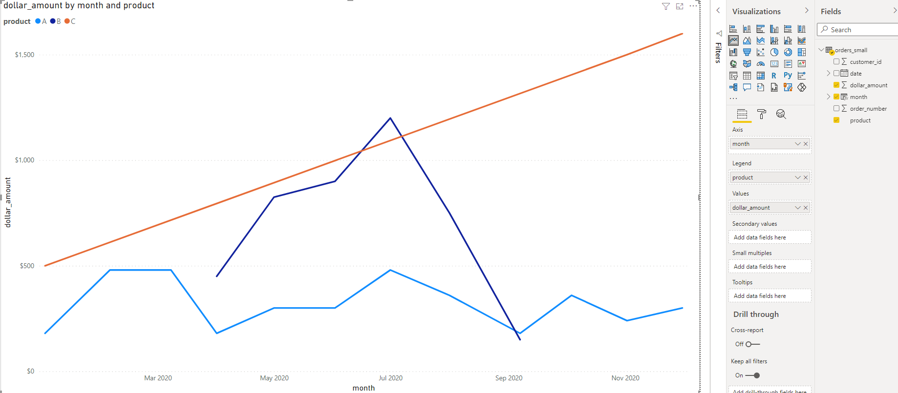
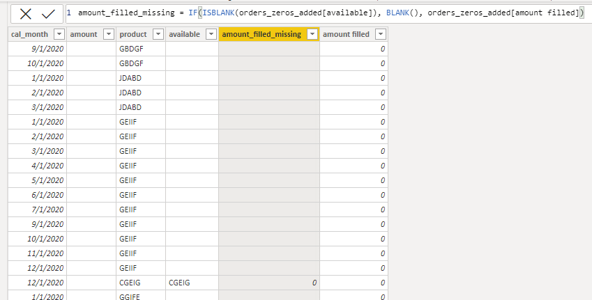
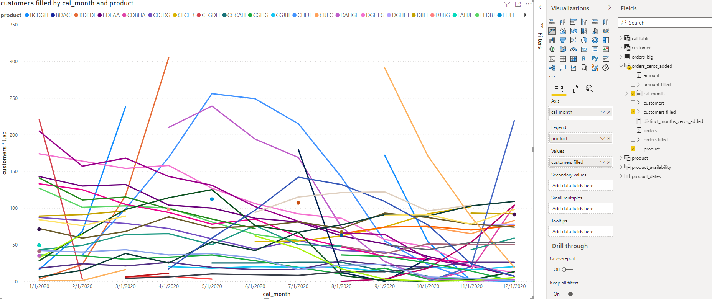

```{r setup, include=FALSE}
knitr::opts_chunk$set(echo = FALSE)
```

# Power BI and Missing Values {.title_slide .center}

Tyler Bradley

<aside class="notes">
Hey, I'm Tyler Bradley. I currently work for a health care organization in Asheville. This presentation comes from a project I worked on that involved solving these issues with missing values in Power BI. For this presentation, I'm assuming you have some familiarity with Power BI. So, I won't walk through all the basics like pulling in data, but basically start after the beginning steps.
</aside>

# Setup {.normal_slide}
<div style="margin-top: 7%; margin-bottom: 10%;">
- Background Example
</div>
<div style="margin-bottom: 10%;">
- Basic Strategies
</div>
<div style="margin-bottom: 10%;">
- Better Strategy
</div>
<div>
- Polishing
</div>

<aside class="notes">
For today's setup we'll cover a background example that explains the issues, go through some basic strategies that might solve your problem, a better strategy that's more work but a lot more robust, and then some additions options for polishing the dashboard.
</aside>

# Background Example {.normal_slide}
<div style="margin-top: 7%;">
- Start out with some data to graph
</div>


<aside class="notes">
You have an orders table. Each row is an order that contains the order number, the product that was sold, a customer id, the date, and the dollar amount. The goal here is to get information on sales over time for each product. So we basically need to sum dollar amount by date.
</aside>

# Background Example {.normal_slide}
<div style="margin-top: 7%;">
```{}
month = STARTOFMONTH(orders_small[date])
```
</div>


<aside class="notes">
Showing the data by day will be too granular, so we want to get it into months. We can add in some DAX code to create a new column for the month of each order. We'll also just use date as a date hierarchy.
</aside>

# Background Example {.normal_slide}
<div style="margin-top: 7%;">

</div>

<aside class="notes">
This graph uses the month column we just created. You can see there are some missing values at the start and end of the dark blue line. The orange line is also suspiciously straight.
</aside>

# Background Example {.normal_slide}
<div style="margin-top: 7%;">

</div>

<aside class="notes">
This graph uses the date column from the data at the month level. You still see the some missing values for the dark blue line, but now the orange line has missing values. The other graph was just connecting them across January to November.
</aside>

# Background Example {.normal_slide}
<div style="margin-top: 7%;">

</div>  

<aside class="notes">
At a close look at the graph you see that there are three products that sale at different time of the year.
</aside>

# Background Example {.normal_slide}
<div style="margin-top: 7%;">

</div>

<aside class="notes">
What we really want to see are all the lines filled in down to zero.
</aside>

# Background Example {.normal_slide}
<div style="margin-top: 7%;">
```{}
sum_amount = SUM(orders_small[dollar_amount])
```
```{}
distinct_months = DISTINCTCOUNT(orders_small[month])
```
```{}
monthly_average = DIVIDE([sum_amount], [distinct_months])
```
</div>


<aside class="notes">
You can also see that this can mess up any calculations. In this example, the monthly_average is wrong because distinct_months is incorrect.
</aside>

# End Product {.normal_slide}
<div class="fragment" style="margin-top: 7%; margin-bottom: 7%;">
- Line graphs and tables by product over time
</div>
<div class="fragment" style="margin-bottom: 7%;">
- Dollar amount
- Number of orders
- Number of distinct customers
</div>
<div class="fragment" style="margin-bottom: 7%;">
- Filter by product and month
</div>
<div class="fragment">
- Fill in zeros for sales when product is available
</div>

# Basic Strategies {.section_slide .center}

# Basic Strategies {.normal_slide}
<div class="fragment" style="margin-top: 7%; margin-bottom: 3%;">
- Show missing items


</div>
<div class="fragment">
- Doesn't work in this example
</div>

<aside class="notes">
You can just add zero to the end of measures.
</aside>

# Basic Strategies {.normal_slide}
<div class="fragment" style="margin-top: 7%; margin-bottom: 5%;">
```{}
sum_amount_zero = SUM(orders_small[dollar_amount]) + 0
```
<div>
<div class="fragment" style="margin-bottom: 5%;">

<div>
<div class="fragment">
- Doesn't fix table
</div>

<aside class="notes">
You can just fix the math if you know it's a constant.
</aside>

# Basic Strategies {.normal_slide}
<div class="fragment" style="margin-top: 7%;">
```{}
monthly_average = DIVIDE([sum_amount], 12)
```
<div>
<div style="margin-bottom: 5%;">
::: {.container}
:::: {.col}

::::
:::: {.col}

::::
:::
</div>
<div class="fragment">
- Doesn't fix graph
</div>

# Basic Strategies {.normal_slide}
<div class="fragment" style="margin-top: 7%; margin-bottom: 15%;">
- Clean the data
</div>
<div class="fragment" style="margin-bottom: 15%;">
- Import monthly data
</div>
<div class="fragment" >
- Import zero
</div>

# Basic Strategies {.normal_slide}
<div class="fragment" style="margin-top: 10%; margin-bottom: 20%;">
- Tend to work easily
</div>
<div class="fragment" >
- But tend to not be extendable
</div>

<aside class="notes">
You can mix and match these strategies, but that can be annoying.
</aside>

# Better Strategy {.section_slide .center}

# Setup with Bigger Dataset {.normal_slide}
<div style="margin-top: 7%;">

</div>  

# End Product {.normal_slide}
<div class="fragment" style="margin-top: 7%; margin-bottom: 7%;">
- Line graphs and tables by product over time
</div>
<div class="fragment" style="margin-bottom: 7%;">
- Dollar amount
- Number of orders
- Number of distinct customers
</div>
<div class="fragment" style="margin-bottom: 7%;">
- Filter by product and month
</div>
<div class="fragment">
- Fill in zeros for sales when product is available
</div>

# Better Strategy {.normal_slide}
<div class="fragment" style="margin-top: 7%;">
- Calendar Table Setup
</div>

# Calendar Table {.normal_slide}
<div class="fragment" style="margin-top: 10%; margin-bottom: 20%;">
- Table created in Power BI that contains all the dates you need and associated information, using the CALENDAR function.
</div>
<div class="fragment">
- Three examples
</div>

# Calendar Table {.normal_slide}
<div class="fragment" style="margin-top: 7%; margin-bottom: 7%;">
```{}
cal_table = CALENDAR(
  DATE(2020, 01, 01),
  DATE(2020, 12, 31))
```
</div>
<div class="fragment" style="margin-bottom: 7%;">
```{}
cal_table = CALENDAR(
  DATE(YEAR(TODAY()) - 1, 01, 01),
  DATE(YEAR(TODAY()) - 1, 12, 31))
```
</div>
<div class="fragment">
```{}
cal_table = CALENDAR(
  MIN(orders_small[date]),
  MAX(orders_small[date]))
```
</div>

# Calendar Table {.normal_slide}
<div style="margin-top: 7%;">
```{}
cal_month = STARTOFMONTH(cal_table[DATE])
```

<div>  
  
# Calendar Table {.normal_slide}
<div style="margin-top: 7%;">
  
</div>  

# Better Strategy {.normal_slide}
<div style="margin-top: 7%; margin-bottom: 15%;">
- Calendar Table Setup +
</div>
<div class="fragment">
- Star Schema
</div>

# Star Schema {.normal_slide}
<div style="margin-top: 10%; margin-bottom: 20%;">
- Main orders table in the middle
</div>
<div>
- Important dimensions on the outside
<div>

<aside class="notes">
Normally a 'suggestion' from Microsoft, but often a great idea.
</aside>

# Star Schema {.normal_slide}
<div style="margin-top: 7%; margin-bottom: 5%;">
```{}
product = SUMMARIZECOLUMNS(orders_big[product])
```
</div>
<div class="fragment" style="margin-bottom: 5%;">
```{}
customer = SUMMARIZECOLUMNS(orders_big[customer_id])
```
</div>
<div class="fragment">
  
</div>  

# Better Strategy {.normal_slide}
<div style="margin-top: 7%; margin-bottom: 15%;">
- Calendar Table Setup +
</div>
<div style="margin-top: 7%; margin-bottom: 15%;">
- Star Schema +
</div>
<div class="fragment">
- ADDMISSINGITEMS()
</div>

# ADDMISSINGITEMS() {.normal_slide}
<div class="fragment" style="margin-top: 10%; margin-bottom: 15%;">
- Adds rows with empty values to a table returned by SUMMARIZECOLUMNS. (MS Docs)
</div>
<div class="fragment">
- Add the rows with empty measure values back. (dax.guide)
<div>

# ADDMISSINGITEMS() {.normal_slide}
<div class="fragment" style="margin-top: 7%; margin-bottom: 7%;">
- ShowAll_ColumnName - What you want to fill in
</div>
<div class="fragment" style="margin-bottom: 7%;">
- Table - Base table with missing data (orders table here)
</div>
<div class="fragment" style="margin-bottom: 7%;">
- GroupBy_ColumnName - What you want to fill in (same as ShowAll_ColumnName unless ROLLUP)
</div>
<div class="fragment">
- FilterTable - Filter out unneeded combinations
</div>

# ADDMISSINGITEMS() {.normal_slide}
<div style="margin-top: 7%; margin-bottom: 7%;">
```{}
orders_zeros_added = 
ADDMISSINGITEMS(cal_table[cal_month], 'product'[product], 
SUMMARIZECOLUMNS(cal_table[cal_month], 'product'[product], 
  "amount", SUM(orders_big[dollar_amount])), 
cal_table[cal_month], 'product'[product])
```
</div>
  

<aside class="notes">
Basically a full join between calendar months and products. You can see ShowAll_ColumnName cal_month and product, the Table is the SUMMARIZECOLUMNS, the GroupBy_ColumnName is the same as the ShowAll_ColumnName, no filters for now.
</aside>

# ADDMISSINGITEMS() {.normal_slide}
<div style="margin-top: 7%; margin-bottom: 7%;">
```{}
orders_zeros_added = 
CALCULATETABLE(ADDCOLUMNS(
ADDMISSINGITEMS(cal_table[cal_month], 'product'[product], 
SUMMARIZECOLUMNS(cal_table[cal_month], 'product'[product], 
  "amount", SUM(orders_big[dollar_amount])), 
cal_table[cal_month], 'product'[product]),
"amount filled", IF(ISBLANK([amount]), 0, [amount])))
```
</div>
  

# ADDMISSINGITEMS() {.normal_slide}
<div style="margin-top: 7%;">
  
</div>  

# High Density Sampling {.normal_slide}
<div style="margin-top: 7%;">
::: {.container}
:::: {.col}

::::
:::: {.col}
<div style="margin-top: 30%;">
- Might need to turn this off
</div>  
::::
:::
</div>

# ADDMISSINGITEMS() {.normal_slide}
<div style="margin-top: 7%;">
 
</div>  

# Polishing {.section_slide .center}

# Polishing {.normal_slide}
<div style="margin-top: 7%;">
- Filter for product availability
</div>

# Filter Product Availability {.normal_slide}
<div style="margin-top: 7%;">
 
</div>

# Filter Product Availability {.normal_slide}
<div style="margin-top: 7%;">
 
</div>

<aside class="notes">
There are multiple rows per product for cases when there are jumps in the dates.
</aside>

# Filter Product Availability {.normal_slide}
<div style="margin-top: 7%;">
```{}
product_availability = 
FILTER(CROSSJOIN(cal_table, product), 
  cal_month[month] >= product[start_month] && 
    cal_month[month] <= product[end_month])
```
</div>
<div>
 
</div>  

# Filter Product Availability {.normal_slide}
<div style="margin-top: 7%;">
 
</div>  

# Filter Product Availability {.normal_slide}
<div style="margin-top: 7%;">
```{}
orders_zeros_added = CALCULATETABLE(ADDCOLUMNS(
ADDMISSINGITEMS(cal_table[cal_month], 'product'[product], 
SUMMARIZECOLUMNS(cal_table[cal_month], 'product'[product], 
"amount", SUM(orders_big[dollar_amount])), 
cal_table[cal_month], 'product'[product], product_availability),
"amount filled", IF(ISBLANK([amount]), 0, [amount])))
```
</div>
<div>
 
</div>  

<aside class="notes">
Same has previous one, but with product_availability used as a filter.
</aside>

# Filter Product Availability {.normal_slide}
<div style="margin-top: 7%;">
 
</div>  

# Filter Product Availability {.normal_slide}
<div style="margin-top: 7%;">
 
</div>  

<aside class="notes">
X axis needs to be set to Categorical
</aside>

# Filter Product Availability {.normal_slide}
<div style="margin-top: 7%;">
 
</div>  

# Filter Product Availability {.normal_slide}
<div style="margin-top: 10%; margin-bottom: 20%;">
- What if you want the graph to be continuous or want all the months with missing for unavailable?
</div>  
<div>
- Let's backtrack a little bit...
</div>  

# Filter Product Availability {.normal_slide}
<div style="margin-top: 7%; margin-bottom: 5%;">
```{}
product_zeros = SUMMARIZECOLUMNS(orders_big[product])
```
</div>
<div style="margin-bottom: 5%;">
```{}
cal_table_month = 
var CalendarDates = 
    GENERATE( CALENDAR(DATE(2020, 01, 01), 
                       DATE(2020, 12, 31)),
    ROW("month", DATE(YEAR( [Date] ), MONTH( [Date] ), 01)))
return
SUMMARIZE(CalendarDates, [month])
```
</div>
<div>
```{}
product_availability = FILTER(
CROSSJOIN(cal_table_month, product_dates), 
  cal_table_month[month] >= product_dates[start_month] && 
    cal_table_month[month] <= product_dates[end_month])
```
</div>

# Filter Product Availability {.normal_slide}
<div style="margin-top: 7%;">
  
</div>  

# Filter Product Availability {.normal_slide}
<div style="margin-top: 7%; margin-bottom: 5%;">
```{}
available = LOOKUPVALUE(product_availability[product], 
product_availability[month], orders_zeros_added[cal_month], 
product_availability[product], orders_zeros_added[product])
```
</div>
<div style="margin-bottom: 5%;">
```{}
amount_filled_missing = IF(ISBLANK(orders_zeros_added[available]), 
  BLANK(), orders_zeros_added[amount filled])
```
</div>
<div>
  
</div>

# Filter Product Availability {.normal_slide}
<div style="margin-top: 7%;">
  
</div>

<aside class="notes">
Need to use cal_table_month for axis.
</aside>

# Filter Product Availability {.normal_slide}
<div style="margin-top: 7%;">
  
</div>

# Filter Product Availability {.normal_slide}
<div style="margin-top: 7%;">
- BLANK is not like SQL NULL
</div>
<div class="fragment" style="margin-bottom: 5%;">
- Converts to 0 in sums and subtractions
- Stays BLANK in divisions and multiplication
</div>
<div class="fragment" style="margin-bottom: 5%; text-align: center">
1 - (A/B) = (B/B) - (A/B) = (B - A)/B
</div>
<div class="fragment" style="margin-bottom: 5%;">
- If B is BLANK
- Left side = 1
- Right side = BLANK
</div>

# Polishing {.normal_slide}
<div style="margin-top: 7%; margin-bottom: 15%;">
- Filter for product availability
</div>
<div class="fragment">
- Add other measures
</div>

# Customers {.normal_slide}
<div style="margin-top: 7%;">
```{}
orders_zeros_added = 
CALCULATETABLE(ADDCOLUMNS(
ADDMISSINGITEMS(cal_table[cal_month], 'product'[product], 
SUMMARIZECOLUMNS(cal_table[cal_month], 'product'[product], 
"amount", SUM(orders_big[dollar_amount]), 
"customers", DISTINCTCOUNT(orders_big[customer_id])), 
cal_table[cal_month], 'product'[product], product_availability),
"amount filled", IF(ISBLANK([amount]), 0, [amount]), 
"customers filled", IF(ISBLANK([customers]), 0, [customers])))
```
</div>
<div>
 
</div>  

# Customers {.normal_slide}
<div style="margin-top: 7%;">
   
</div>  

# Customers {.normal_slide}
<div style="margin-top: 7%;">

</div>  

# Orders {.normal_slide}
<div style="margin-top: 7%;">
```{}
orders_zeros_added = 
CALCULATETABLE(ADDCOLUMNS(
ADDMISSINGITEMS(cal_table[cal_month], 'product'[product], 
SUMMARIZECOLUMNS(cal_table[cal_month], 'product'[product], 
"amount", SUM(orders_big[dollar_amount]), 
"customers", DISTINCTCOUNT(orders_big[customer_id]), 
"orders", DISTINCTCOUNT(orders_big[order_number])), 
cal_table[cal_month], 'product'[product], product_availability),
"amount filled", IF(ISBLANK([amount]), 0, [amount]), 
"customers filled", IF(ISBLANK([customers]), 0, [customers]), 
"orders filled", IF(ISBLANK([orders]), 0, [orders])))
```
</div>
<div>
 
</div>  

# Orders {.normal_slide}
<div style="margin-top: 7%;">
   
</div>  

# Orders {.normal_slide}
<div style="margin-top: 7%;">
  
</div>  

# Polishing {.normal_slide}
<div style="margin-top: 7%; margin-bottom: 15%;">
- Filter for product availability
</div>
<div style="margin-bottom: 15%;">
- Add other measures
</div>
<div class="fragment">
- Filters
</div>

# Filters {.normal_slide}
<div style="margin-top: 7%; margin-bottom: 15%;">
- Just use the built in filters for the table
</div>
<div class="fragment" style="margin-bottom: 15%;">
- Use Star Schema again (will need to create new tables)
</div>
<div class="fragment">
- That's pretty much it.
</div>

# End {.title_slide .center}